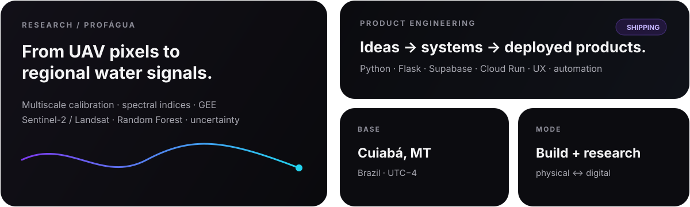

<div align="center">
  
</div>

<p align="center">
  <a href="https://gabrielreboucas.com"></a>
  <a href="https://www.linkedin.com/in/gabriel-rebou%C3%A7as-4489141b4/"></a>
  <a href="https://agencia808.com"></a>
</p>

<br/>

## `01 / profile`

I’m a **Control & Automation Engineer** working across **software, data, digital products and applied research**. I currently work as a **Project Development Analyst at Conecta Hub** and develop products that connect technical systems to clear, usable interfaces.

Alongside product and engineering work, I’m a **ProfÁgua / UNEMAT graduate researcher in Water Resources**, investigating **multiscale remote sensing** with multispectral UAV imagery, satellite time series and machine-learning methods for water-stress analysis in the **Pantanal transition**.

My work usually sits at the intersection of **Python + cloud systems + geospatial data + automation + UX** — from an idea or field problem to a working interface, model, dashboard or deployed service.

<div align="center">
  
</div>

<br/>

## `02 / what I build`

<table>
<tr>
<td width="33%" valign="top">

### Product systems
Web apps, internal platforms, dashboards and operational tools with an emphasis on clarity, performance and maintainability.

`Flask` `JavaScript` `HTML/CSS` `Supabase` `Cloud Run`

</td>
<td width="33%" valign="top">

### Data & automation
Data pipelines, process automation, business analysis and decision-support workflows that turn fragmented information into usable systems.

`Python` `SQL` `APIs` `GitHub` `Cloud Build`

</td>
<td width="33%" valign="top">

### Applied research
Remote sensing, UAV data, spectral indices and machine-learning workflows applied to environmental monitoring and water resources.

`GEE` `Sentinel-2` `Landsat` `MicaSense` `Random Forest`

</td>
</tr>
</table>

<br/>

## `03 / current stack`

<p align="center">
  
</p>

<p align="center">
  <code>Python</code> · <code>Flask</code> · <code>JavaScript</code> · <code>SQL</code> · <code>Google Cloud Run</code> · <code>Supabase</code> · <code>GitHub Actions / Cloud Build</code> · <code>Google Earth Engine</code> · <code>Figma</code> · <code>Fusion 360</code> · <code>Blender</code> · <code>Unity</code>
</p>

<br/>

## `04 / research & engineering`

- **Water resources + remote sensing** — radiometric calibration across UAV and satellite scales, multispectral imagery, spectral water-stress indicators and uncertainty analysis.
- **Geospatial ML** — Random Forest, downscaling and cross-scale validation using Google Earth Engine, Sentinel-2/Landsat and drone acquisitions.
- **Inclusive product design** — research and prototyping of playful robotic interfaces for neurodivergent children, combining UX, physical prototyping and interactive systems.
- **Rapid prototyping** — 3D modeling, additive manufacturing, electronics, augmented reality and functional proof-of-concepts.

> **Recent publication**  
> *Requirements Specification Approach for 3D Modeling of Robot Otto for therapy sessions with autistic children* — Projetica.  
> [Read the publication →](https://ojs.uel.br/revistas/uel/index.php/projetica/article/view/48223)

<br/>

## `05 / selected context`

```text
engineering      → control, automation, prototyping, systems thinking
software         → Python, Flask, web interfaces, APIs, cloud deployment
data             → analysis, pipelines, dashboards, geospatial workflows
research         → UAV + satellite remote sensing, water resources, ML
product          → UX, visual systems, experimentation, delivery
```

<br/>

## `06 / GitHub`

<div align="center">
  
  
</div>

<br/>

<div align="center">
  <sub>Based in Cuiabá, Mato Grosso, Brazil · building at the intersection of physical systems, software, data and design.</sub>
</div>
