  

  
  
  

I’m a **Control & Automation Engineer** working at the intersection of technology, product and visual systems. I build digital products at **Agência 808**, develop automations and cloud-backed tools, and prototype physical ideas through **3D modeling and additive manufacturing**.

<table>
<tr>
<td width="33%" valign="top">
<strong>01 / Digital products</strong> 
Web experiences, dashboards, UX/UI, internal tools and product interfaces.
</td>
<td width="33%" valign="top">
<strong>02 / Systems + automation</strong> 
Python, Flask, APIs, Supabase, Cloud Run and practical workflow automation.
</td>
<td width="33%" valign="top">
<strong>03 / 3D + creative tech</strong> 
Fusion 360, Blender, rapid prototyping, 3D printing, GSAP and WebGL experiments.
</td>
</tr>
</table>

  

<table>
<tr>
<td width="58%" valign="top">
<strong>Selected direction</strong>  

→ product interfaces that feel simple, fast and intentional 
→ automation that removes repetitive work 
→ 3D objects designed to become real products 
→ experimental web experiences without sacrificing performance

  
<a href="https://gabrielreboucas.com"><strong>Open portfolio ↗</strong></a>
</td>
<td width="42%" valign="top">
<strong>Research, briefly</strong>  

ProfÁgua / UNEMAT — applied research connecting multispectral UAV imagery, satellite data and machine learning to water-resources monitoring.

  
<strong>UAV × GEE × remote sensing</strong>
</td>
</tr>
</table>

<strong>↳ More about what I’m exploring</strong>

 
I’m interested in systems where <strong>software meets the physical world</strong>: automation, sensing, digital fabrication, interactive interfaces, geospatial data and tools that make complex processes easier to operate.
  
On the research side, my current work in ProfÁgua explores multiscale radiometric calibration and validation between drone and satellite imagery for environmental monitoring. It is a complementary research track — my main day-to-day focus remains product, technology and building.

### Activity

  

  
  

  <a href="https://gabrielreboucas.com">portfolio</a> · <a href="https://agencia808.com">agência 808</a> · <a href="https://github.com/gabereboucas?tab=repositories">repositories</a> · <a href="https://www.linkedin.com/in/gabriel-rebou%C3%A7as-4489141b4/">linkedin</a>

